# kachakachaCAD 取扱説明書(V2)

プラ板と紙で鉄道模型を作るための CAD です。
この説明書は、実際の画面を撮ったものと一緒に、全部の機能を順に説明します。

図はすべて `kachakacha_cad_next.exe --manual-state <名前> --snapshot <png>` で
撮ったものです。人が手で撮り直していないので、画面が変われば図も変わります。
図を作り直す手順は「図の作り直し」にあります。

---

## 目次

1. [はじめに](#1-はじめに)
2. [画面の見かた](#2-画面の見かた)
3. [4つのモード](#3-4つのモード)
4. [作図](#4-作図)
5. [吸着とグリッド](#5-吸着とグリッド)
6. [数値で入れる](#6-数値で入れる)
7. [選ぶ](#7-選ぶ)
8. [視点](#8-視点)
9. [まとまり(グループ)](#9-まとまりグループ)
10. [形をつくる(部品モード)](#10-形をつくる部品モード)
11. [製作モード](#11-製作モード)
12. [書き出し](#12-書き出し)
13. [手順の帯](#13-手順の帯)
14. [見た目を変える](#14-見た目を変える)
15. [困ったとき](#15-困ったとき)
16. [見本の文書](#16-見本の文書)
17. [図の作り直し](#17-図の作り直し)

---

## 1. はじめに

### できること

- 紙とプラ板から作る部材の形を決める。
- 曲がった車体を、平らな板から作れる形に割る。
- 1:1 の型紙(PDF / SVG / DXF)と、立体(STEP / STL)を出す。

### この道具の約束

**できないことを、できたことにしません。**

たとえば、線がつながっていなくて面が張れないとき、
勝手に近い点をくっつけて「できました」とは言いません。
どこが、どれだけ離れているかを番号つきで言って、断ります。

画面に出る知らせは、すべて `GEO-W001` のような番号を持っています。
この番号は文面が変わっても変わらないので、困ったときはこの番号で探せます。

### 動かすもの

Windows。`kachakacha_cad_next.exe` を起動します。

版を確かめるには `kachakacha_cad_next.exe --version` と打ちます。

---

## 2. 画面の見かた

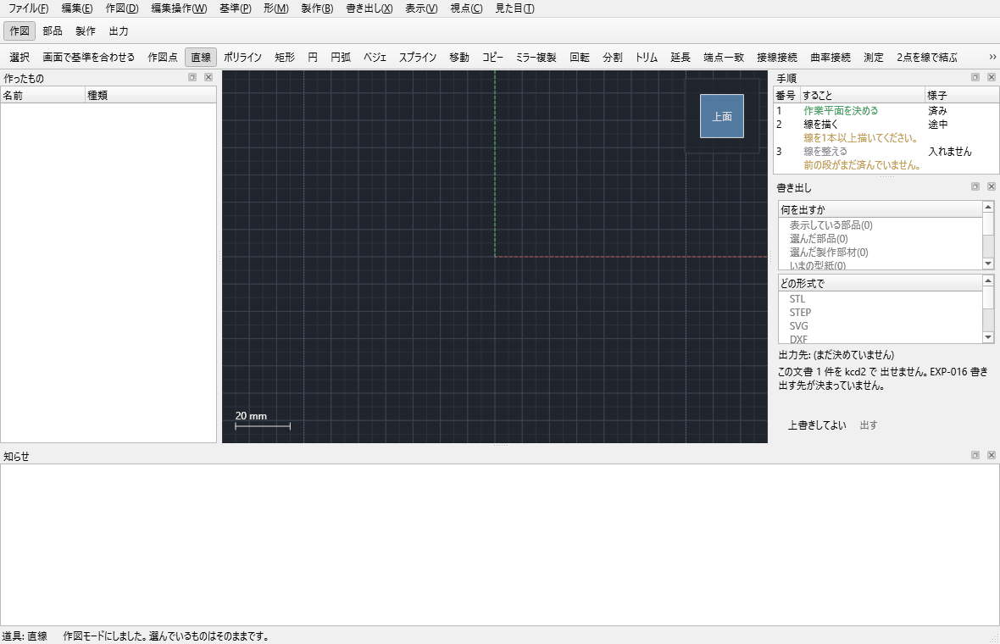

| 場所 | 名前 | すること |
| --- | --- | --- |
| いちばん上 | メニュー | すべての操作がここにあります。 |
| その下 | モードの帯 | 作図・部品・製作・出力を切り替えます。 |
| その下 | 道具箱 | いま使えるは道具だけが並びます。 |
| 左 | 作ったもの | 文書に入っているものの一覧です。 |
| 中央 | 画面 | ここに描きます。 |
| 右 | 手順 / 形状ガイドの役割 / 書き出し | いまのモードに合わせて出ます。 |
| 下 | 知らせ | 断られた理由が番号つきで並びます。 |
| いちばん下 | 帯 | いまの道具・まとまり・次にすることが出ます。 |

道具箱もメニューもショートカットも、**同じ1本の道**を通ります。
メニューから押しても、道具箱から押しても、同じことが起きます。

---

## 3. 4つのモード

上の帯で切り替えます。**モードを変えても、選んでいるものと文書は変わりません。**
変わるのは「出てくる道具」だけです。

| モード | 何をするところ |
| --- | --- |
| 作図 | 線を引く。寸法を決める。 |
| 部品 | 線から面と立体を作る。 |
| 製作 | 立体を、板から作れる部材へ割る。 |
| 出力 | 型紙と立体を出す。 |

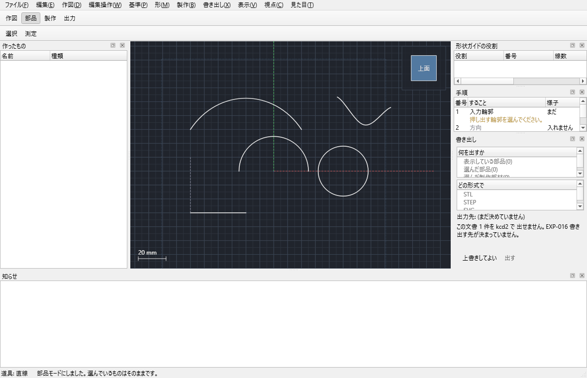

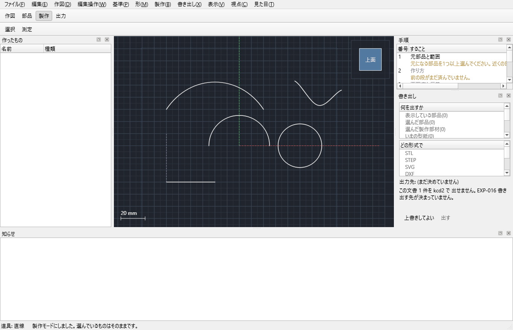

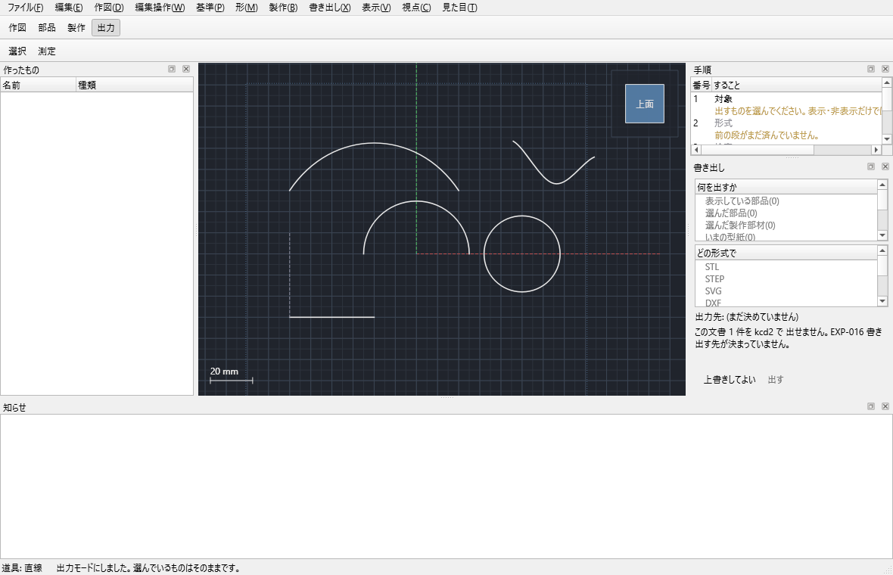

---

## 4. 作図

道具箱から道具を選び、画面を押していきます。

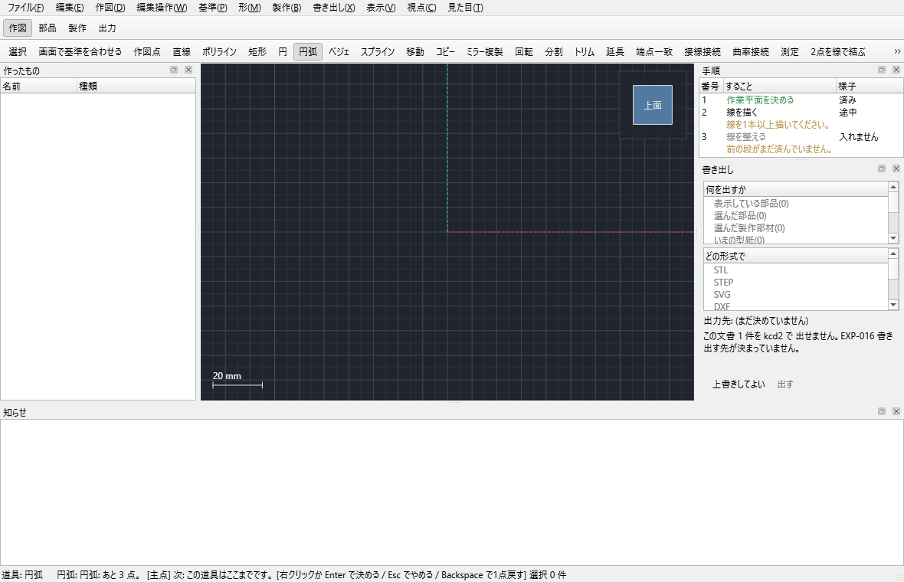

| 道具 | ショートカット | 置く点 |
| --- | --- | --- |
| 点 | — | 1点 |
| 直線 | — | 2点 |
| 連続線 | — | 何点でも(右クリックで終わり) |
| 矩形 | — | 対角の2点 |
| 円 | — | 中心と半径の点 |
| 円弧 | — | 3点 |
| ベジェ | — | 4点 |
| B-spline | — | 4点以上 |

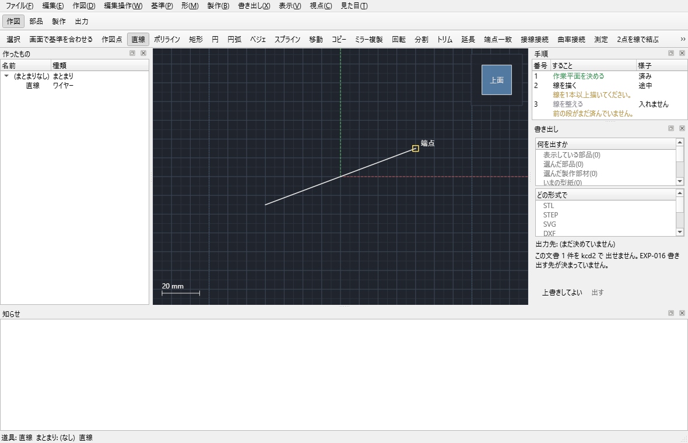

- 途中でやめるときは `Esc`。置いた点は捨てられ、文書は変わりません。
- 1つ前の点だけ消すときは `Backspace`。
- 元に戻すのは `Ctrl+Z`、やり直すのは `Ctrl+Y`。

### 曲線は曲線のまま

円弧を折れ線にしません。円は円のまま、B-spline は B-spline のまま持ちます。
型紙に出すときも、SVG は円弧コマンド、DXF は `ARC` / `SPLINE` で出ます。


---

## 5. 吸着とグリッド

近くに端点・中点・交点があると、そこへ吸着します。
何に吸着したかは画面に名前で出ます。

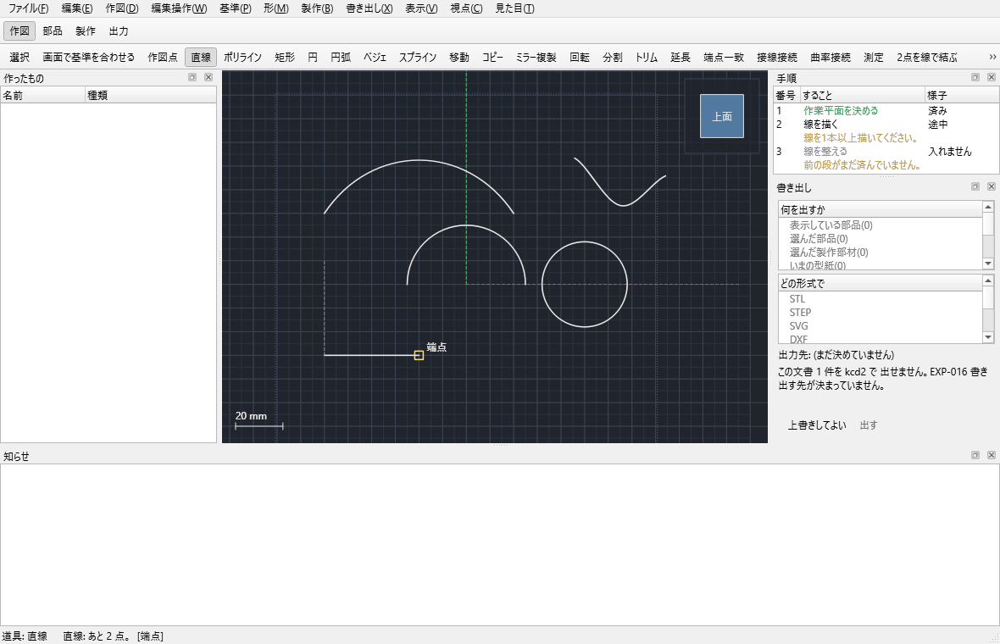

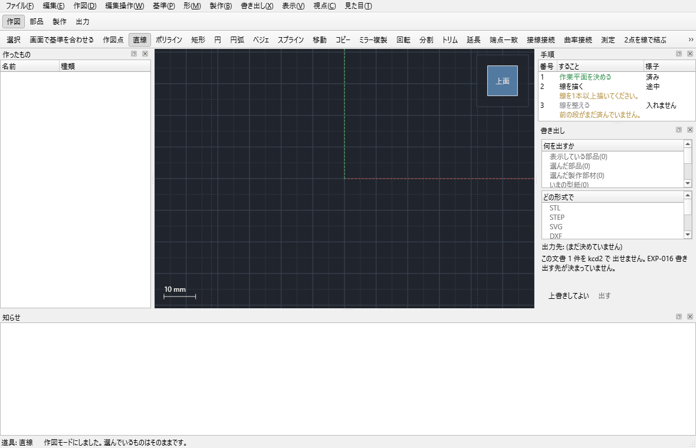

- 吸着を一時的に止めるには `Shift` を押しながら動かします。
- グリッドの間隔は「基準」メニューから変えられます。
- 副点(細かい目盛)は、画面上で 6px より狭くなると自動で消えます。
  出したままにすると、点が多すぎてどれに吸着したのか分からなくなるためです。

---

## 6. 数値で入れる

道具を使っている途中で数字を打つと、カーソルの横に入力欄が出ます。

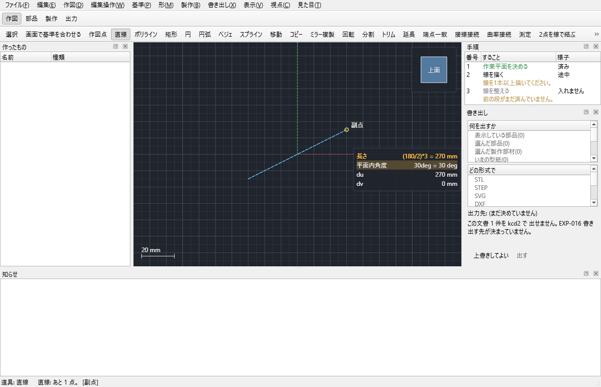

- 道具ごとに「主要な欄」が1つ決まっていて、そこへ自動で焦点が合います。
- `Tab` で次の欄、`Shift+Tab` で前の欄へ移ります。
- `Enter` で確定、`Esc` でやめます。
- 式が書けます。`(180/2)*3` と打つと `(180/2)*3 = 270 mm` と出ます。
  全角で打っても通ります。
- **確定した欄はマウスで動きません。** 打っている途中の欄も動きません。
  動くのは、まだ触っていない欄だけです。

入れた値どうしが合わないときは、最後に変えた欄だけを確定しません。
`UI-C004 入れた値どうしが合いません。` と出ます。

---

## 7. 選ぶ

道具箱の「選択」を選び、線を押します。

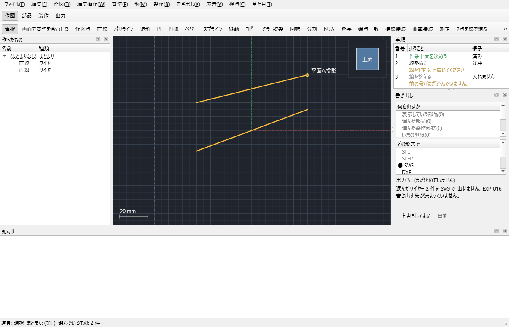

| 押しかた | すること |
| --- | --- |
| そのまま押す | それだけを選ぶ(前の選択は消える) |
| `Shift` を押しながら | 足す |
| `Ctrl` を押しながら | 入っていれば外し、無ければ足す |
| `Alt` を押しながら | 外す |

- 何も無いところをそのまま押すと、選択が空になります。
  足している途中(`Shift` など)に外を押しても、選択は消えません。
- **選んだ順は変わりません。** 形状ガイドの役割は選んだ順で決まるためです。
- 消したものは、選択からも自動で外れます。

---

## 8. 視点

右上のビューキューブを押すと、その面へ正対します。

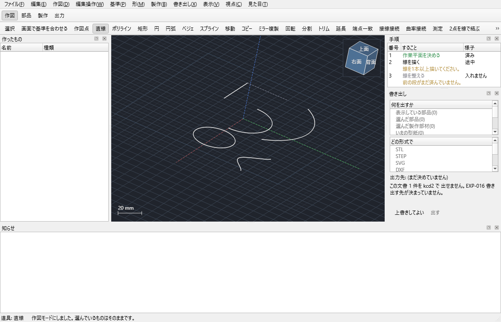

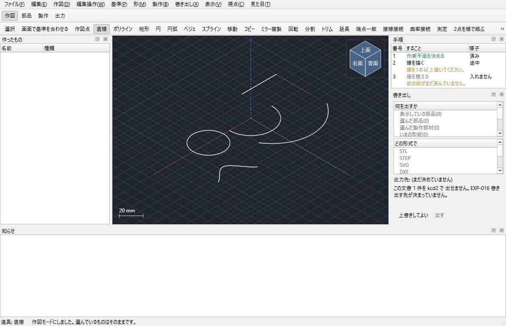

- キューブは面 6・辺 12・角 8 の 26 か所を押し分けられます。
- ドラッグすると回ります。**離した瞬間に近い向きへ吸い付いたりしません。**
  89度まで回しても、勝手に90度へ寄せません。
- 「全体表示」(`F`)で、描いたもの全部が入る大きさにします。
- 視点を変えても、文書は変わりません。

---

## 9. まとまり(グループ)

作ったものは「作業中のまとまり」へ入ります。いまどれが作業中かは、下の帯に出ます。


- 作業中のまとまりを変えても、既にあるものは動きません。
- 派生してできたもの(型紙など)は、元の下の派生まとまりへ入ります。
  作業中を切り替えても、そこからは動きません。

---

## 10. 形をつくる(部品モード)

線から面を作り、面から立体を作ります。

### 形状ガイド

複数の線を「役割」に割り当てて、面を作ります。

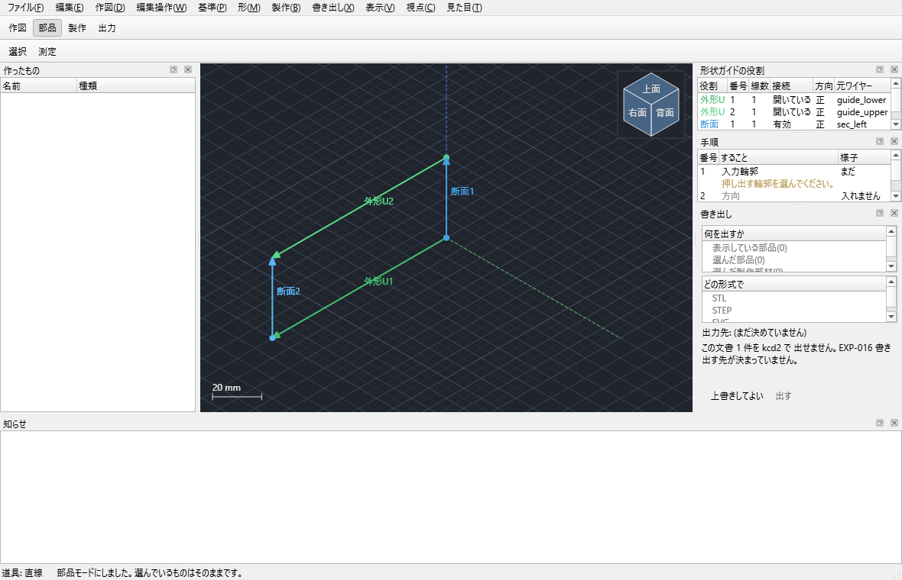

- 表の行の色は、画面の中の線の色と同じです。
  どの線がどの役割なのかを、表と画面の両方で同時に見られます。
- 役割が足りないときは、**どの役割が足りないか**を書いて断ります。
  勝手に「近い線」を割り当てません。
- 行は入れ替えられます。方向も反転できます。

### 押し出し

輪郭と厚みを決めて立体にします。板の厚みは外側・中央・内側のどれに付けるか選べます。

---

## 11. 製作モード

立体を、板から作れる部材へ割ります。

- 二重に曲がっているところには、切れ目(relief)を入れます。
  向きは、曲がりの強い方向から決めます。
- 組み立ての進み具合(0% / 30% / 100%)を変えられます。
  **どの状態でも、辺の長さは変わりません。** 変わるのは形だけです。
- 型紙にする前に検査します。通らなければ出しません。

---

## 12. 書き出し

右の「書き出し」から出します。

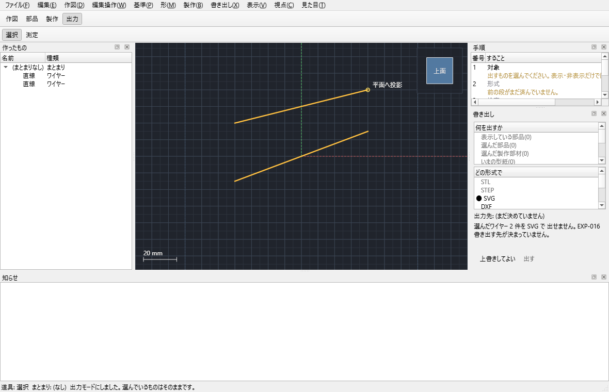

### 何を出すか

| 対象 | 出せる形式 |
| --- | --- |
| 表示している部品 | STL / STEP |
| 選んだ部品 | STL / STEP |
| 選んだ製作部材 | STL / STEP / SVG / DXF / 1:1 PDF |
| いまの型紙 | SVG / DXF / 1:1 PDF |
| 選んだワイヤー | SVG / DXF / 1:1 PDF |
| この文書 | kcd2 |

- 数が 0 のものも一覧から消しません。消すと「選んでいない」のか
  「そもそも無い」のかが分からなくなるためです。薄く出して、選べなくします。
- 対象を変えても、いまの形式がその対象でも使えるなら、形式は変わりません。
- 出せない組合せは、押す前に断ります(`EXP-017`)。
- 出す先を決めていなければ押せません(`EXP-016`)。
- 同じ名前のファイルがあれば、「上書きしてよい」を押すまで出しません(`EXP-018`)。
- 出す先を変えると、上書きの承諾は取り消されます。別のファイルへの承諾ではないためです。

### 出すときの約束

- 検査に通ってから、はじめて中身を作ります。
  先に作ると、断られたときの計算が丸ごと無駄になるためです。
- **0バイトのファイルを残しません。** 中身が空なら、ファイルを作らずに断ります。
- 書いている途中で失敗しても、前のファイルは読める形で残ります。
- 型紙は実寸です。紙に入らないからといって縮めません。
- 同じ入力からは同じバイト列が出ます。版管理に載せられます。

---

## 13. 手順の帯

右の「手順」に、いまのモードでやることが番号順に並びます。

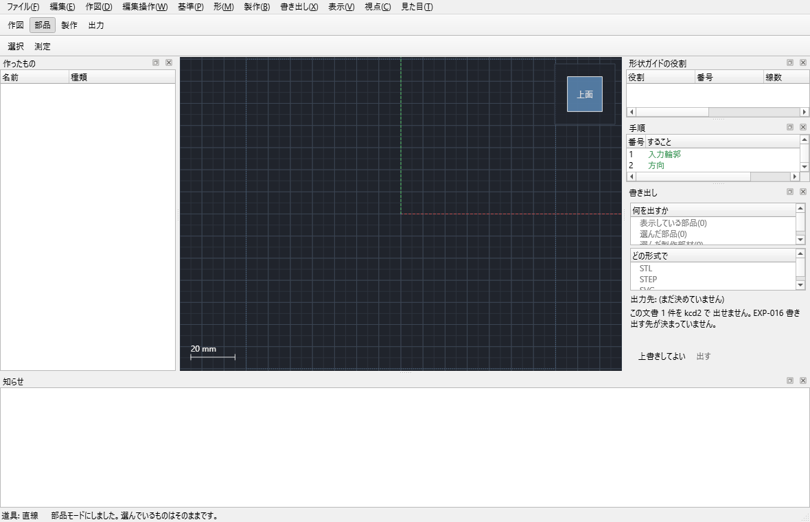


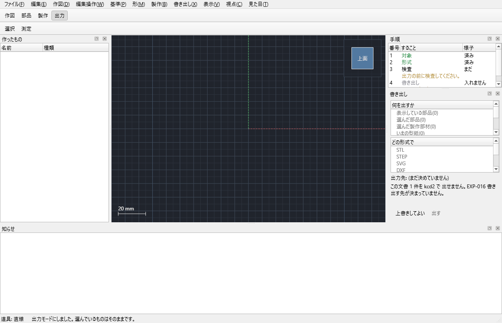

- 前の段が済むまで、先の段には入れません。
- 入れない段には、**なぜ入れないか**が書いてあります。

---

## 14. 見た目を変える

「見た目」メニューから、通常と Windows 95 風を切り替えられます。

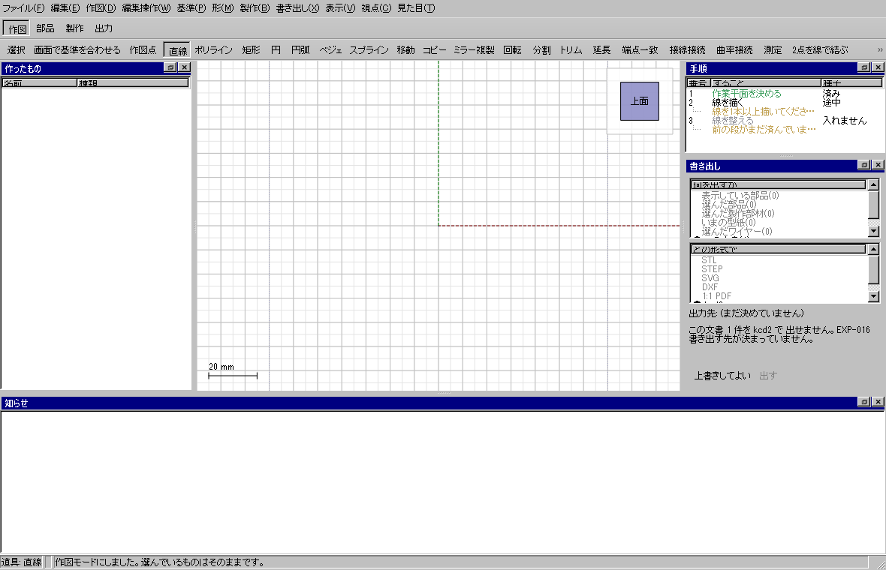

線の見え方も、見た目によって変わります。曲線は曲線のままです。

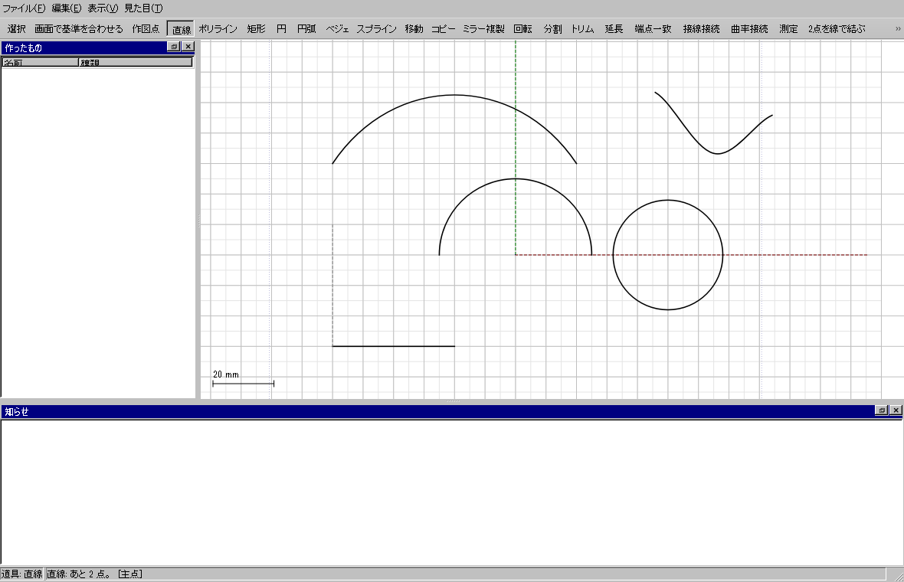

どちらでも、画面の部品ははみ出しません。
1366x768 でも 1920x1080 でも、拡大率 100% / 125% / 150% / 200% でも同じです。

---

## 15. 困ったとき

### 知らせの番号

下の「知らせ」に出る `GEO-W001` のような番号は、文面が変わっても変わりません。
番号の一覧は `docs/v2/diagnostic-catalog.md` にあります。よく出るものだけ挙げます。

| 番号 | 意味 | どうするか |
| --- | --- | --- |
| `GEO-W001` | となりあう線がつながっていません。 | 端点を吸着させてつなぎ直します。 |
| `GEO-W003` | 端点がぴったり合っていません。 | どれだけ離れているかが本文に出ます。 |
| `GEO-W004` | ワイヤーが自分自身と交わっています。 | 交わっているところを直します。 |
| `UI-R009` | 面を作るための行がそろっていません。 | 足りない役割が本文に出ます。 |
| `EXP-015` | 出すものが選ばれていません。 | 先に選びます。表示・非表示では決まりません。 |
| `EXP-016` | 書き出す先が決まっていません。 | 「出す先を選ぶ…」で決めます。 |
| `EXP-017` | その形式では出せません。 | 一覧で選べる形式に変えます。 |
| `EXP-018` | 同じ名前のファイルが既にあります。 | 「上書きしてよい」を押すか、別の名前にします。 |

### 重い操作

100ms を超える計算には、途中でやめる道が出ます。
やめても文書は変わりません。

### 落ちたとき

保存は、書いている途中で失敗しても前のファイルが読める形で行います。
`.kcd2` の隣に `.bak` が残っていることがあります。これが直前のものです。

---

## 16. 見本の文書

`samples/v2-sample.kcd2` を開くと、1/87 の車体側面が入っています。

| 中身 | 数 |
| --- | --- |
| 側面の外形(実物 20000mm x 3000mm を 1/87) | 1 |
| 腰の高さ(補助線) | 1 |
| 窓 | 6 |
| 前照灯(円) | 1 |

この見本で、この説明書の 4・5・7・8・12 章がそのまま試せます。

「ファイル」→「開く」から開きます。画面を出さずに開いて確かめるには、

```
kachakacha_cad_next.exe --open samples\v2-sample.kcd2
```

と打ちます。`--snapshot` を足すと、開いた絵だけを撮って終わります。

見本を作り直すには次のように打ちます。

```
kachakacha_v2_write_sample samples/v2-sample.kcd2
```

見本を直して置き直し忘れると `v2_sample_document_tests` が落ちます。
説明書の図と中身がずれないようにするためです。

---

## 17. 図の作り直し

図はすべて、次の形で撮ったものです。

```
kachakacha_cad_next.exe --manual-state <名前> --snapshot docs\manual\images\v2-<名前>.png
```

`<名前>` に使えるものは
`empty` `grid` `tools` `curves` `curves-win95` `draw-line` `snap` `isometric`
`win95` `guide` `mode-part` `mode-fabrication` `mode-output` `view-cube`
`guide-table` `cursor-input` `active-group` `steps-part` `steps-fabrication`
`steps-output` `select` `export` `sample` です。

画面の大きさを決めるには `--size 1366x768` を足します。

画面を出さずに一通り触って確かめるには `--self-test` と打ちます。
