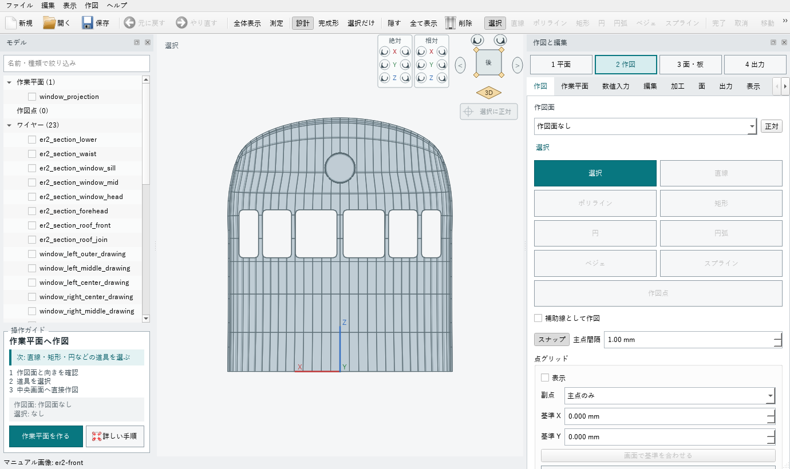
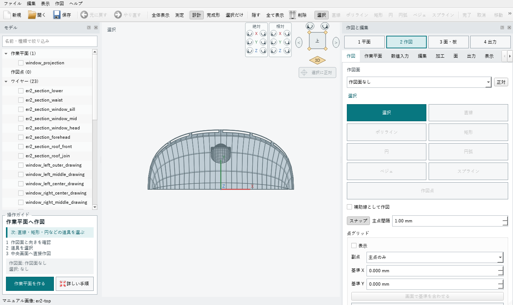
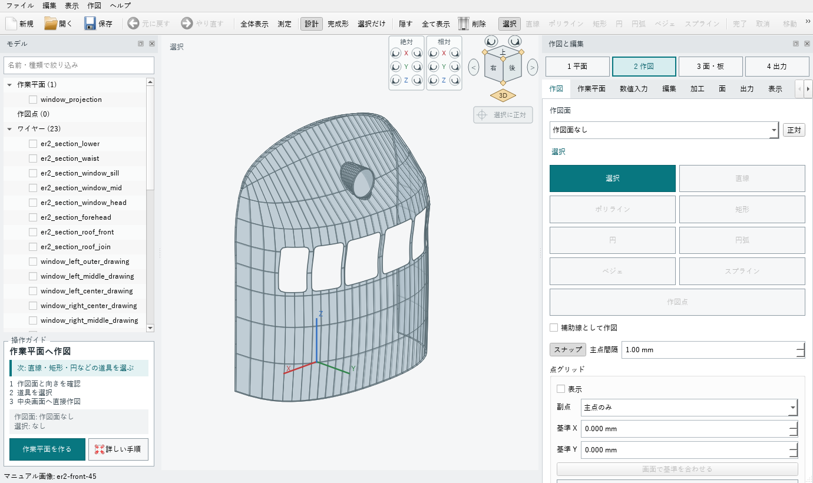
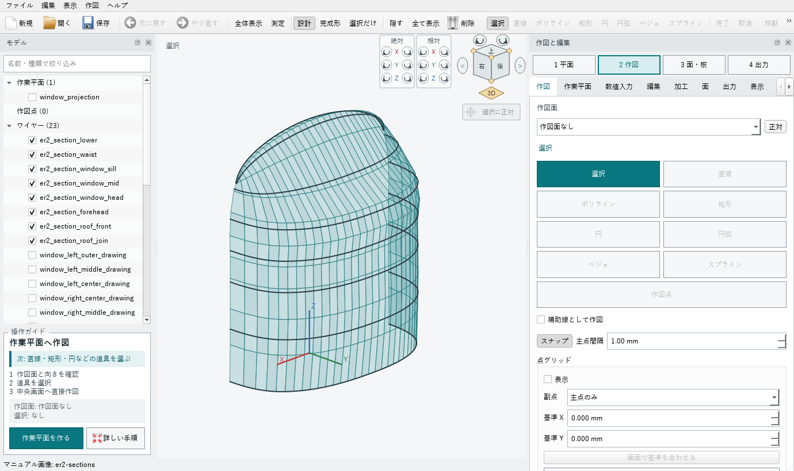
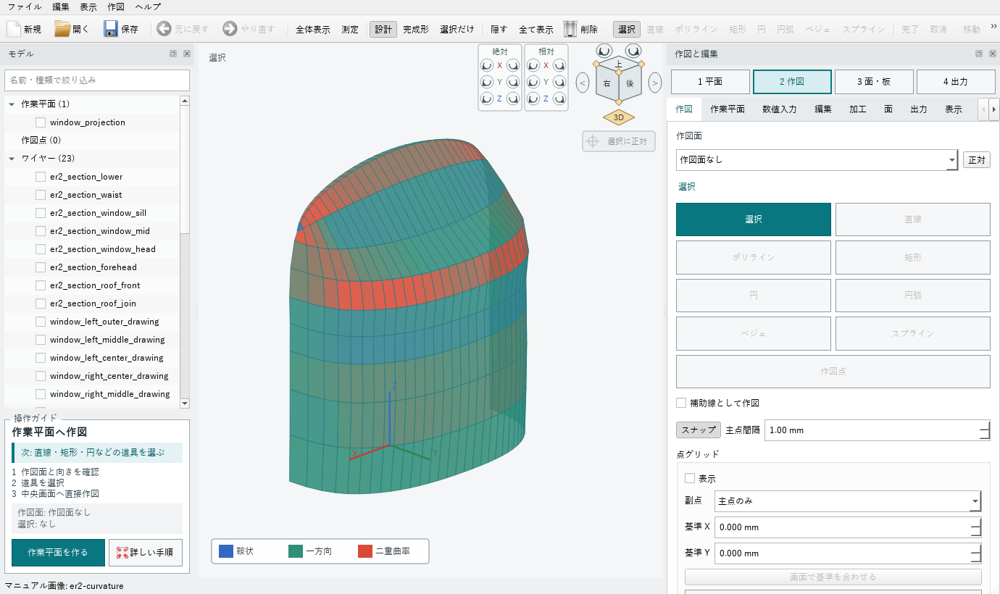
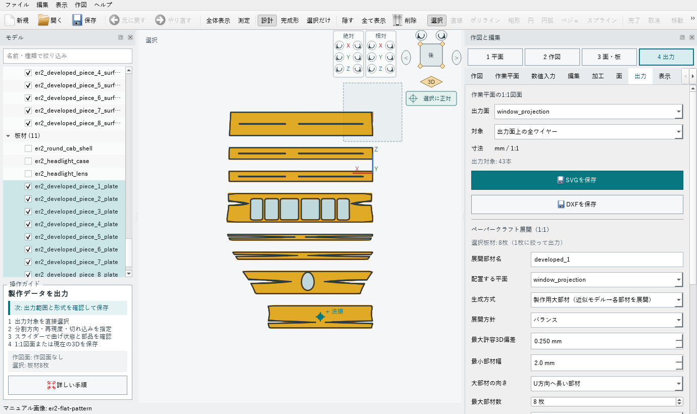
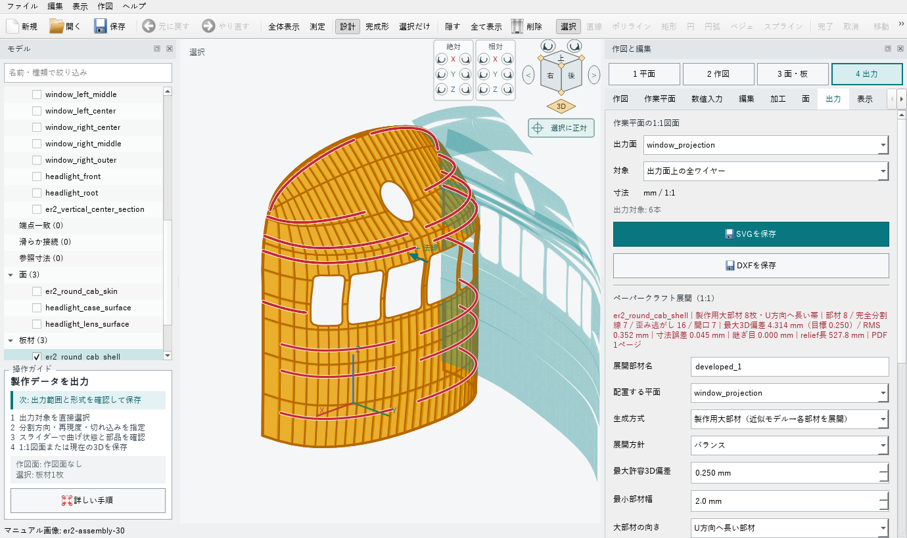
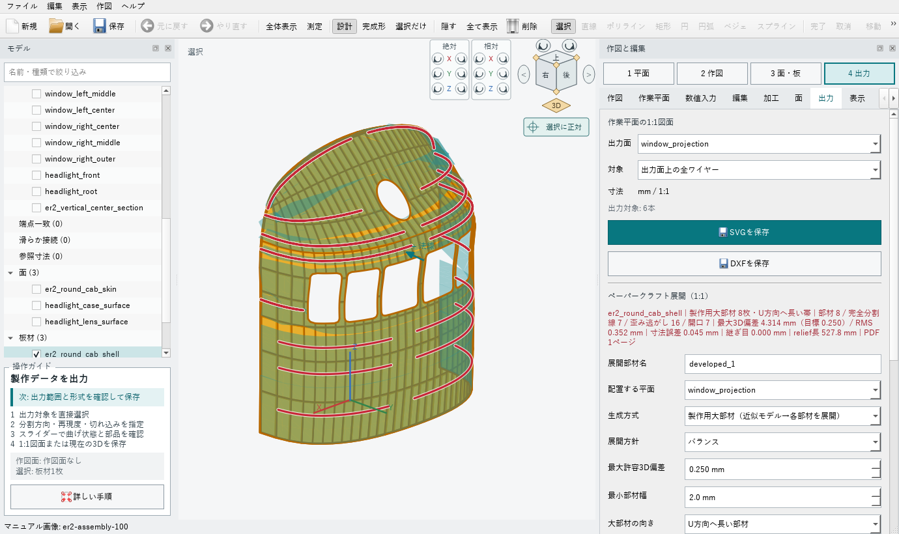

# ER1 / 初期ER2 丸形前頭部 1/87テストモデル

## 目的

`examples/er1-er2-round-cab-1-87.kcd` は、部材優先・連続パネル優先の展開処理を評価するための短い前頭部シェルです。完成車両の復元模型ではなく、一方向曲率、緩い二重曲率、強い二重曲率、6枚の窓開口を一つの入力面に混在させた試験形状です。

## 寸法の扱い

- 確認寸法: 車体幅 3480 mm、1/87で 40.00 mm
- テスト用近似値: 前頭部奥行き、全高、窓寸法、屋根遷移、前照灯寸法
- 単位: 1/87模型上の mm

不明な寸法は実車寸法として扱わず、スクリプト内でも `test-geometry approximation` と明記しています。

## 面構成

- 前頭外皮: 高さ方向8断面から作る1枚のロフト面
- 窓: 独立した6開口。中央2枚が最も広く、外側ほど狭い
- 前照灯: 外皮とは別の筒状ケースと前面板
- 板厚: 外皮 0.30 mm、前照灯ケース 0.25 mm

入力面を展開しやすい小片へ先に分割していません。横長の大部材、局所的な逃げ切れ、追加分割の判断はペーパークラフト生成側で行います。

## 形状確認画像

`scripts/build-er2-test-assets.ps1` は、同じモデルから正面、上面、側面、前方45度、ワイヤーフレーム、水平断面、垂直中心断面、曲率表示、展開部材、組立30%・100%を生成します。

曲率表示は、緑がガウス曲率の小さい一方向曲率に近い領域、赤が正の二重曲率、青が鞍状の二重曲率です。色はモデルを変形せず、面の微分値だけから計算します。

| 正面 | 上面 | 前方45度 |
|---|---|---|
|  |  |  |

| 水平断面 | 曲率 | 部材展開 |
|---|---|---|
|  |  |  |

| 組立30% | 組立100% |
|---|---|
|  |  |

## 部材優先展開の現状値

検証設定は、横長部材、最大8部材、最小部材幅2.0 mm、目標偏差0.25 mmです。6枚窓と前照灯は7個の開口として維持され、組立0%・30%・100%で材料面積は変化しません。

2026年8月28日時点の最大偏差は4.347 mmで、0.25 mmの目標には未到達です。窓帯は開口を横切らず大部材を維持する制約、額から屋根肩は強い二重曲率のため誤差が残ります。この試験体では未達を隠さず回帰テストへ残し、局所切れ込み・追加分割・部材方向の改善対象として扱います。
