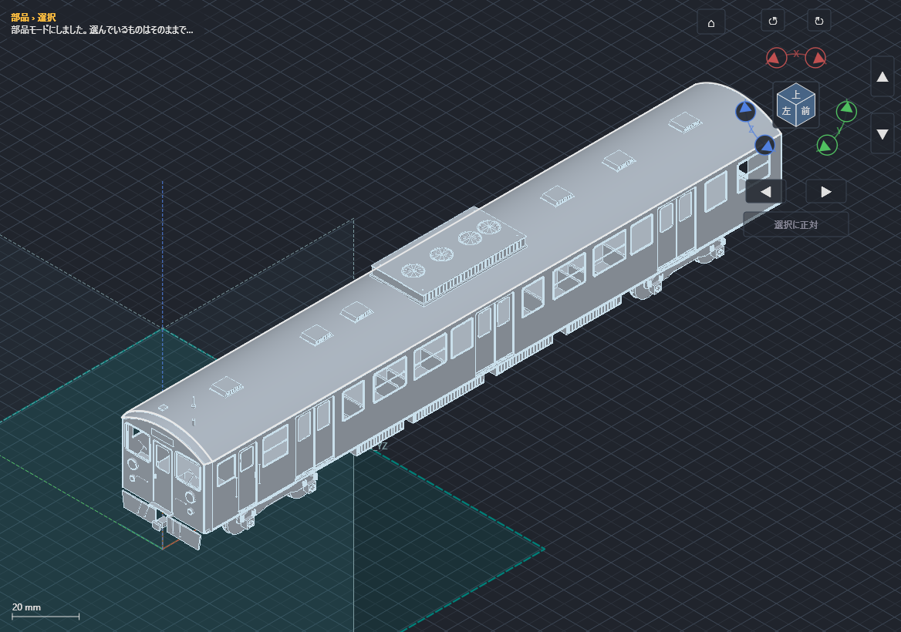

# 115系1000番台・クモハ冷房車の重量級モデル（1/80）

`series115-1000-1-80.kcd2` を **修正版の kachakacha_cad_next.exe** で開く。
ネイティブのワイヤ・ロフト面・押し出し・厚みフィーチャから再生成するモデルであり、
外部ソフトで作ったメッシュを取り込んだものではない。



[前面拡大](front-detail.png) / [台車](bogie.png) / [室内](interior.png)

## 内容

- 1,083立体、1,367元ワイヤ、2参照面、102グループ。
- 車体：窓・扉の実開口、サッシ、上下窓中桟、客扉左右葉、乗務員扉、手すり。
- 前面：貫通扉、窓ゴム、ワイパー、前照灯・尾灯のリムとレンズ、渡り板。
- 屋根：円弧断面外板、前頭部ロフト、冷房装置、ファン格子、通風器、アンテナ。
- 床下：台枠、横梁、機器箱、蓋・ボルト・ルーバー、空気溜、配管、連結器、スカート。
- 台車：側枠、輪軸、フランジ、軸箱、ばね、ブレーキ部品、主電動機・歯車箱。
- 室内：セミクロスシート、ロングシート、荷棚、つり革、運転室・計器。

元輪郭は非表示にしてある。左のツリーで対象グループを展開して表示・編集できる。
屋根・車体・室内・台車は独立グループなので、一部を非表示にして内部を確認できる。
円・円弧は解析曲線のまま保持し、表示やSTL用の三角形はCADで生成する。

## 寸法の根拠と精度

公式資料：[しなの鉄道 会社概要2025、車両図・諸元（PDF18ページ）](https://www.shinanorailway.co.jp/corporate/docs/company2025.pdf)。
形式の外観参考：[KATO 115系1000番台 湘南色](https://www.katomodels.com/product/n/115kei_1000_syonan)。
引用元の写真・図面そのものは同梱していない。

|寸法|実車資料|モデル|
|---|---:|---:|
|連結面間距離|20,000 mm|250 mm|
|最大幅|2,950 mm|36.875 mm（ステップを含む）|
|屋根高さ|3,654 mm|45.675 mm|
|床面高さ|1,225 mm|15.3125 mm|

窓・扉の配置、車体絞り、屋根曲率、床下機器配置、台車細部、室内細部は**近似**。
特定車番・特定年の完全な実測復元ではない。車体長19,500 mm、車輪径860 mm、軸距2,100 mm等は
モデル設計の公称値として採用し、今回入手した公式図だけでは各細部の寸法公差を保証しない。
ばねは独立した環の積層で表現しており、連続したらせんの近似。
ガラス・塗装・銘板文字・すべての配線経路は未再現。

## 工作への使い方

外板は0.35 mm、窓枠や手すりは別部品。全車一体のSTLをそのまま造形する完成データではない。
最小部品には直径0.14 mmのファン格子等がある。小物は金属線やエッチング部品への置換、
使用する材料・プリンタに応じた厚さ変更が必要。部品間の接触・重なりを許す組立検討モデルで、
一括出力したSTLは単一の融合ソリッドではない。グループ/部品を選択して必要なものを出力する。
車体の走行機構・集電・模型用連結器規格との適合は未検証。

## 再生成と実機試験

リポジトリ直下で実行する。

```text
python tools/modeling/series115.py
python tools/modeling/benchmark.py
```

`benchmark.py` は実際のCADを使用し、全立体再生成、表示画像、局所表示、12フレームの回転描画、
保存再読込、STL/STEP出力、屋根の近似・曲げ状態・型紙出力を検査する。
出力先の既定は `_claudeout/115-heavy`。`--exe`、`--output`、`--platform offscreen` を指定可能。
これはネイティブ実装の自動操作試験であり、すべてを手動マウス操作で作図したという意味ではない。
測定結果と限界は `docs/v2/ui-redesign/HEAVY_MODEL_115_REPORT.md` に記録する。
